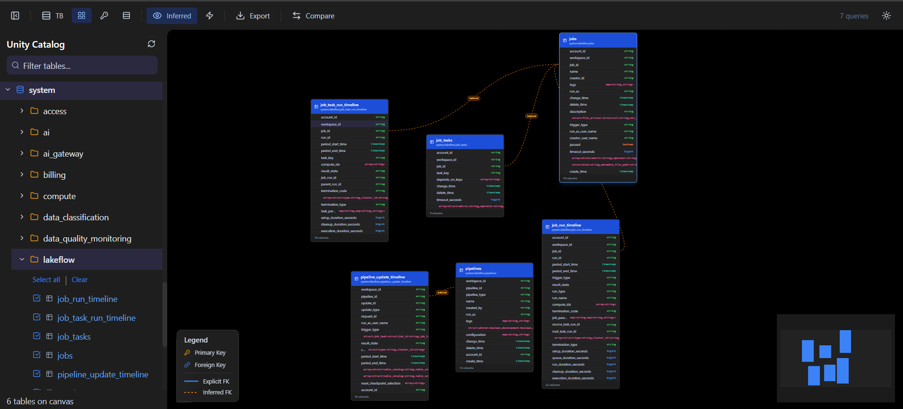

# ERD Viewer for Databricks Unity Catalog

An interactive Entity-Relationship Diagram viewer that connects directly to your Databricks Unity Catalog, visualizing table schemas, foreign key relationships, and column-level data lineage — all within your Databricks workspace.



---

## Features

### ERD Visualization
- **Interactive canvas** — drag, zoom, pan, and explore your schema visually
- **Custom table nodes** — columns with type badges, PK/FK indicators, and comments on hover
- **Foreign key edges** — explicit FK constraints rendered as labeled relationship lines
- **Inferred relationships** — optional heuristic FK detection based on column naming patterns
- **Auto-layout** — hierarchical (top-bottom, left-right) and force-directed layout via ELK.js

### Schema Browsing
- **Catalog tree** — browse catalogs, schemas, and tables in a collapsible sidebar
- **Multi-select** — choose which tables to visualize on the canvas
- **Search & filter** — quickly find tables within a schema
- **Detail panel** — click any table to see full column metadata and DDL

### Schema Comparison
- **Schema-to-schema diff** — compare all tables across two schemas in one shot to detect drift between environments or medallion layers
- **Table-to-table diff** — compare individual tables across catalogs for focused inspection
- **Color-coded results** — added (green), removed (red), modified (amber) at both table and column level
- **Expandable detail** — click any modified table in schema comparison to see column-level changes

### Column-Level Lineage
- **Upstream & downstream flow** — see what feeds into a table and where its data goes
- **Visual flow diagram** — mini lineage chart in the detail panel
- **Per-column detail** — expandable view showing exact column-to-column data flow
- **Powered by system tables** — queries `system.access.column_lineage` (last 30 days)

### Export & Sharing
- **PNG / SVG** — export the current canvas view as an image
- **DDL export** — generate CREATE TABLE statements for selected tables
- **JSON state** — save and reload diagram layouts
- **Shareable URLs** — encode catalog/schema/table selection in the URL

### User Experience
- **Dark mode** — matches the Databricks workspace theme
- **Keyboard shortcuts** — `T` theme, `I` inferred, `L` layout, `Ctrl+F` search, `Esc` close
- **On-behalf-of-user auth** — each user sees only the catalogs, schemas, and tables they have access to
- **Per-user caching** — in-memory TTL cache scoped by user identity

---

## Quick Start

### Prerequisites
- Databricks workspace with Unity Catalog enabled
- SQL Warehouse (serverless, pro, or classic)
- Databricks CLI v0.270.0+ with a configured profile
- Python 3.11+ and Node.js 18+

### Deploy to Databricks

1. **Clone the repository**
   ```bash
   git clone <repo-url>
   cd erd-viewer
   ```

2. **Configure your environment**

   Copy the templates and fill in your values:
   ```bash
   cp example.databricks.yml databricks.yml
   cp backend/example.app.yaml backend/app.yaml
   ```

   Edit `databricks.yml` with your workspace URL, profile, and warehouse ID:
   ```yaml
   targets:
     dev:
       workspace:
         host: https://your-workspace.azuredatabricks.net/
         profile: your-profile
       variables:
         warehouse_id:
           default: your-warehouse-id
   ```

3. **Deploy**
   ```bash
   ./deploy.sh dev
   ```
   This builds the frontend, copies static files, validates the bundle, deploys, and starts the app.

4. **Add the SQL scope**

   In your Databricks workspace:
   - Go to **Compute > Apps > erd-viewer > Authorization**
   - Click **+Add scope** and select `sql`
   - Save and restart the app

5. **Open the app**

   Navigate to the app URL in your Databricks workspace. On first visit, you'll be prompted to consent to the SQL scope.

### Local Development

```bash
# Backend
cd backend
pip install -r requirements.txt
uvicorn app:app --reload          # http://localhost:8000

# Frontend (separate terminal)
cd frontend
npm install
npm run dev                        # http://localhost:5173
```

The frontend dev server proxies `/api` requests to the backend. You'll need Databricks CLI auth configured for the backend to connect to your workspace.

---

## Architecture

```
┌─────────────────────────────────────────────────────┐
│                   Databricks App Host                │
│                                                      │
│  ┌──────────────┐       ┌──────────────────────┐    │
│  │  React SPA   │◄─────►│   FastAPI Backend     │    │
│  │  (Frontend)  │  REST │                        │    │
│  │              │       │  ┌──────────────────┐  │    │
│  │  React Flow  │       │  │  Cache Layer     │  │    │
│  │  ELK.js      │       │  │  (In-Memory TTL) │  │    │
│  │  Tailwind    │       │  └───────┬──────────┘  │    │
│  │  Zustand     │       │          │              │    │
│  └──────────────┘       │  ┌───────▼──────────┐  │    │
│                         │  │  SQL Connector    │  │    │
│                         │  │  (OBO User Auth)  │  │    │
│                         │  └──────────────────┘  │    │
│                         └──────────────────────┘  │    │
└─────────────────────────────────────────────────────┘
```

| Layer | Technology |
|-------|-----------|
| Frontend | React 18, TypeScript, React Flow, ELK.js, Tailwind CSS, Zustand |
| Backend | FastAPI, Python 3.11+, databricks-sql-connector |
| Auth | On-behalf-of-user (OBO) via `x-forwarded-access-token` |
| Caching | cachetools TTLCache (in-memory, per-user) |
| Deploy | Databricks Asset Bundles |

---

## Authentication

The app uses **on-behalf-of-user authorization**. When a user accesses the app through Databricks, the platform forwards their OAuth access token. All SQL queries execute with the user's identity, respecting Unity Catalog permissions including row-level filters and column masks.

- The `sql` scope must be configured in the app's authorization settings
- Users only see catalogs, schemas, and tables they have access to
- No data is stored — all queries are read-only and results are cached in-memory with TTL expiration

---

## Configuration

### Environment Variables (app.yaml)

| Variable | Description | Default |
|----------|-----------|---------|
| `SQL_WAREHOUSE_ID` | SQL Warehouse ID for metadata queries | Required (via `valueFrom: sql-warehouse`) |
| `CACHE_TTL_SECONDS` | Cache TTL in seconds | `300` (5 minutes) |
| `MAX_TABLES_ON_CANVAS` | Maximum tables on canvas | `100` |
| `LOG_LEVEL` | Logging level | `INFO` |

### Deployment Targets (databricks.yml)

The bundle supports multiple targets (dev, uat, prod). Each target specifies:
- Workspace URL and CLI profile
- SQL Warehouse ID
- User permissions

---

## API Reference

| Method | Endpoint | Description |
|--------|----------|-------------|
| GET | `/health` | Databricks infra health check |
| GET | `/api/health` | Detailed health (warehouse + connectivity) |
| GET | `/api/me` | Current user info |
| GET | `/api/config` | App configuration |
| GET | `/api/catalogs` | List accessible catalogs |
| GET | `/api/catalogs/{c}/schemas` | List schemas in a catalog |
| GET | `/api/catalogs/{c}/schemas/{s}/tables` | Tables with column details |
| GET | `/api/catalogs/{c}/schemas/{s}/tables/{t}` | Single table detail |
| GET | `/api/catalogs/{c}/schemas/{s}/relationships` | FK relationships |
| GET | `/api/catalogs/{c}/schemas/{s}/tables/{t}/lineage` | Column-level lineage |
| POST | `/api/compare` | Table-to-table schema comparison |
| POST | `/api/compare/schemas` | Schema-to-schema comparison (all tables) |
| POST | `/api/export/ddl` | Generate DDL statements |

All data endpoints support `?refresh=true` to bypass cache.

---

## Keyboard Shortcuts

| Key | Action |
|-----|--------|
| `T` | Toggle dark/light theme |
| `I` | Toggle inferred relationships |
| `L` | Cycle layout (TB → LR → Force) |
| `Ctrl/Cmd + F` | Focus search |
| `Ctrl/Cmd + 0` | Fit diagram to view |
| `Esc` | Close panel / clear selection |

---

## Troubleshooting

| Issue | Solution |
|-------|---------|
| No catalogs showing | Open in incognito to trigger OAuth consent for the `sql` scope |
| Empty schema list | Check that the catalog has workspace bindings for this environment |
| Lineage tab empty | Lineage requires `system.access.column_lineage` access and recent query activity (last 30 days) |
| Slow initial load | SQL warehouse cold start — subsequent loads use cache |
| 403 errors | Re-add the `sql` scope in the app's Authorization settings and restart |

---

## Documentation

- [Installation Guide](docs/INSTALL.md) — step-by-step deployment and local dev setup
- [Configuration Reference](docs/CONFIGURATION.md) — environment variables, auth, caching
- [Contributing Guide](docs/CONTRIBUTING.md) — how to contribute

## Contributing

See [docs/CONTRIBUTING.md](docs/CONTRIBUTING.md) for detailed setup instructions.

1. Fork the repository
2. Create a feature branch
3. Make and test your changes
4. Run `cd frontend && npm run build` to verify the build
5. Submit a pull request

---

## License

Apache 2.0 — see [LICENSE](LICENSE) for details.
